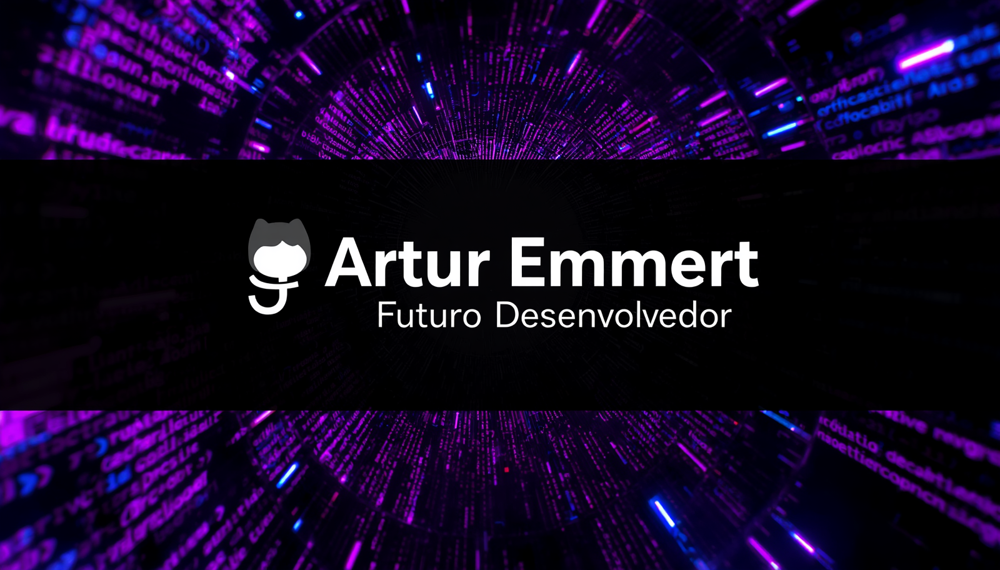

# 👋 Olá, eu sou o Artur Emmert

### 🚀 Sobre mim
- 💼 Atualmente trabalho como projetista e desenvolvedor de scripts para automoção.
- 🎓 Estudando ciência da computação na Univerisidade Feevale.
- 👨🏻‍💻 Focado em aprender diferentes tecnologias para pode atuar como FullStack ou posteriormente focar em uma área específica.
- 💡 Gosto de praticar diferentes abordagens e metódos, já tendo alguns projetos em andamento.

### 💻 Minhas Skills

<table align="center" border="0">
  <tr>
    <td align="center" width="33%" valign="top"><b>Front-end</b></td>
    <td align="center" width="33%" valign="top"><b>Back-end & Linguagens</b></td>
    <td align="center" width="33%" valign="top"><b>Banco de Dados</b></td>
  </tr>
  <tr>
    <td align="center" valign="top">
        
        
        
        
      
    </td>
    <td align="center" valign="top">
        
        
      
    </td>
    <td align="center" valign="top">
        
      
    </td>
  </tr>
</table>
